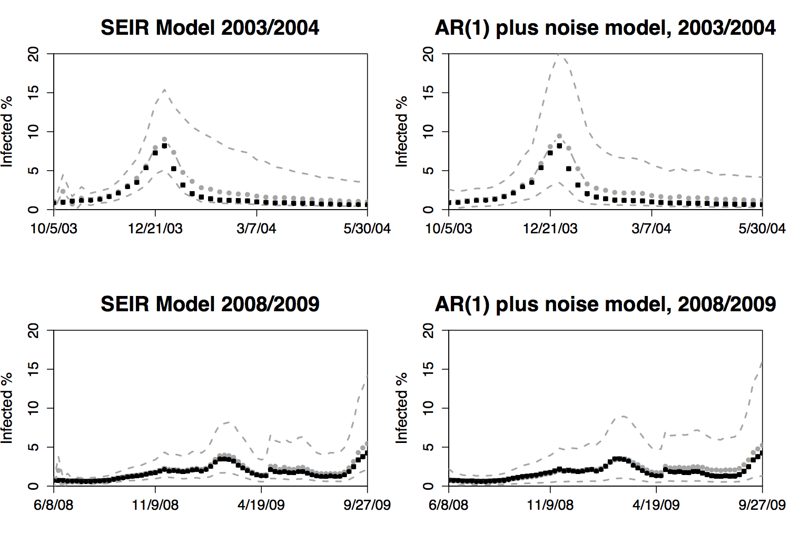
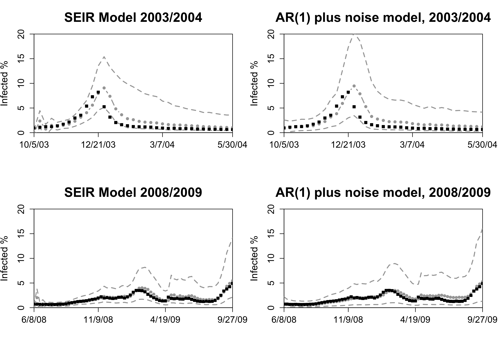
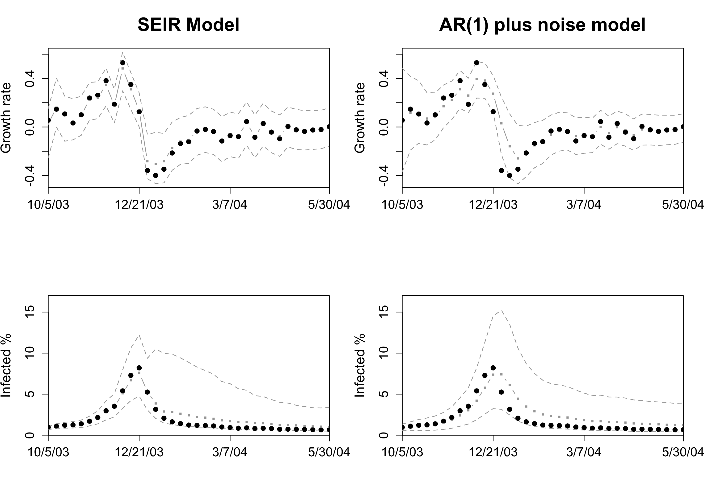
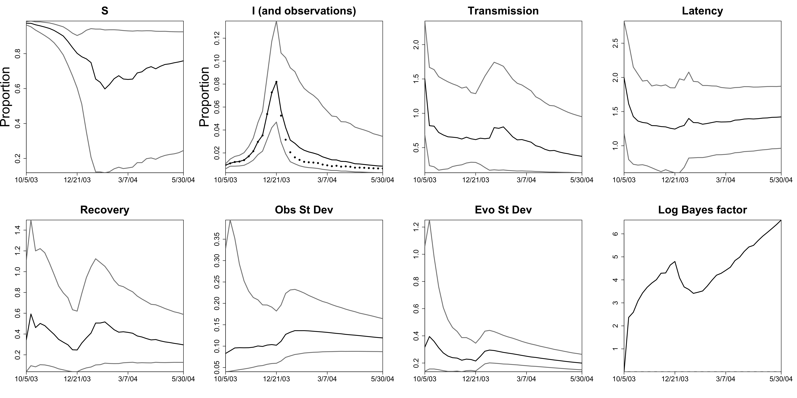
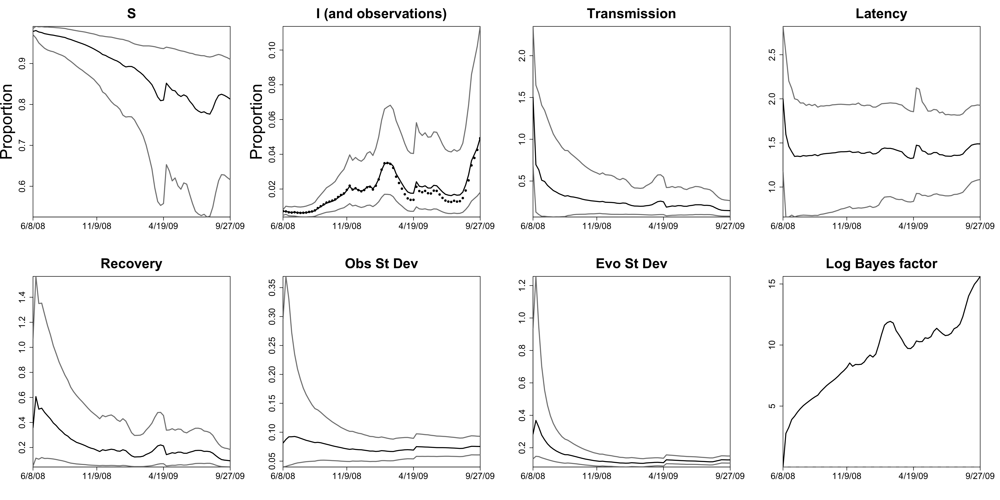

SLA-SEIR
========

Sequential Learning Algorithm for state space SEIR epidemiological model

This is an optimized R code for sequential learning algorithm for state space SEIR epidemiological model used in Dukic, V., Lopes, H. F., & Polson, N. G. (2012). [Tracking epidemics with Google flu trends data and a state-space SEIR model](http://www.tandfonline.com/doi/abs/10.1080/01621459.2012.713876). Journal of the American Statistical Association, 107(500), 1410-1426. I commented and modified the code to facilitate my understanding to Dukic et al.'s paper. For the raw R code please contact the authors.

After reviewing Dukic et al.'s code, my comments are as follows:

Problems
--------

-   In the implementation of `ar1plusnoise` function, Dukic et al. update *b**t* by *b**t* = *b**t* − 1 + (*y**t* − *g**t*)2 rather than by the iterative formula presented in their paper, *b**t* = *b**t* − 1 + (*y**t* − *g**t*)2/2. Fixing this problem produces a Figure 10 as follows:

Therefore, the absence of dividing 2 results in the **wrong** conclusion that "The AR(1) model predictions are not very accurate and reflect the inability of this simple model to capture the structure of the epidemic process well". Now the relative mean squared error (RMSE) of the AR(1) model versus the state-space SEIR model is 0.96 for the 2003/2004 and 1.31 for the 2008/2009 season using the random number seed provided by Dukic et al., which suggests that the AR(1) model can also track the epidemic trajectory as well as the state-space SEIR model does, even better in the 2003/2004 season.

-   When calculating the relative mean squared error and plotting the Figure 10, Dukic et al. compare the 1-week-ahead predictions at week *t* + 1 with the actual observations *y* at week *t* (*t* = 1, 2, ⋯, 35), which is unreasonable. Further fixing this problem produces a Figure 10 as follows:

As shown in above figure, the 1-week-ahead predictions from both the state-space SEIR model and AR(1) model suffer 1-week lag compared to the corresponding observations, which is also confirmed by Figure 8 in Dukic et al.'s paper. It is obvious that both models fail to predict the epidemic peak. I also develop a shiny application (<https://caijun.shinyapps.io/forecast/>) to illustrate the correct comparing process between 1-week-ahead predictions and the actual observations.

Now the RMSE of the AR(1) model versus the state-space SEIR model is 1.08 for the 2003/2004 and 1.14 for the 2008/2009 season using the random number seed provided by Dukic et al. It is worth noting that the RMSE is reported based on one simulation with specified random number seed, which is not robust if the simulations are performed many times. I run the simulations for 100 times using the 10,000 particles, the mean RMSE of the AR(1) model versus the state-space SEIR model is 1.08 (95% CI, \[0.89, 1.3\]) for the 2003/2004 and 0.94 (95% CI, \[0.51, 1.55\]) for the 2008/2009 season. If 100,000 particles are used, the mean RMSE of the AR(1) model versus the state-space SEIR model is 1.1 (95% CI, \[1.04, 1.17\]) for the 2003/2004 and 1.34 (95% CI, \[0.98, 1.58\]) for the 2008/2009 season. This suggests that comparing to the simple state space AR(1) model, the state space SEIR model does't show much improvements in tracking the epidemic trajectory and predicting the epidemic peak.

I also reproduce the Figure 9 and the result is as follows

When reproducing the bottom two plots of the infected fraction *p*(*I**t*|*y**t*), since *p*(*I**t*|*y**t*) borrows information from *y**t*, hence it is reasonable that the observed infected fraction is compared from week 2. As shown in the above figure, indeed, "the AR(1) model is unable to capture the structure of the process as well as the SEIR model."

In sum, for the sequential posterior distribution of the infected fraction *p*(*I**t*|*y**t*), the AR(1) model is unable to capture the structure of the process as well as the SEIR model; however, for the 1-week-ahead prediction of the infected fraction *p*(*y**t* + 1|*y**t*), comparing to the AR(1) model, the SEIR model does't show much improvements in tracking the epidemic trajectory and predicting the epidemic peak.

Improvements
------------

-   Dukic et al.'s code provides two methods to calculate log Bayes factor. One is using `PFlike` function, which is used in Figure 5 and 6 in their paper. The other is provided in `PF1` function, which contains the particle replenishing process. I use the latter to reproduce the log Bayes factor panel in Figure 5 and 6. The results are as follows:

As shown in the reproductions of log Bayes factor plot in Figure 5 and 6, calculating log Bayes factor with particle replenishing process is more rensonable as it more sensitive to the variations in transmission parameter *β*. For example, in the Figure 5, while the transmission began to increase sharply around 12/14/03, the log Bayes factor began to decrease, indicating less evidence in favor of a seasonal epidemic. The same phenomenon can be observed in Figure 6.

-   TODO: how to improve the state space model in order to make it able to predict the epidemic peak?

Typos
-----

-   In *3.2.1 Example of the Sequential Learning Algorithm for AR(1) Model*, *Q**t*−1*q**t* = *Q**t* − 1−1*b**t* − 1 + *g**t**x**t* should be *Q**t*−1*q**t* = *Q**t* − 1−1*q**t* − 1 + *g**t**x**t*. In the same section, Dukic et al. implement *d**t* = *d**t* − 1 + (*g**t* − *q**t*′*x**t*)*y**t*/2 + (*q**t* − 1 − *q**t* − 1)′*Q**t* − 1−1*q**t* − 1/2 by replacing *y**t* with *g**t*. I am not sure whether it is a coding trick or a typo for the iterative formula.

-   In the step 7 of **Sequential Learning Algorithm for state-space SEIR**, the variance of normal distributin should be (1 − *η*2)*V**ψ* rather than (1 − *η*)2*V**ψ* according to equation (10.3.12) in Liu and West (2001).
